# 프로젝트명 (Runner Way)

## 프로젝트 개요

Runner Way는 러닝 코스 추천 기반 기록 관리 및 대결 서비스입니다. 본 프로젝트는 사용자가 기록한 러닝 데이터를 바탕으로 맞춤형 코스 추천 및 경로 시각화를 제공합니다.코스의 경사도를 분석하여 사용자에게 최적의 운동 경험을 제공합니다.

## 주요 기능

- **경로 추천**: 사용자 기록을 기반으로 유사한 코스를 찾아 추천
- **경로 시각화**: 지도 상에서 경로를 시각화하고 경사도와 함께 표시
- **경사도 분석**: DEM 데이터를 사용해 경사도 계산 및 내리막 경사도 계산 및 코스 난이도화
- **사용자 기록 관리**: 사용자의 운동 기록(거리, 칼로리, 경과 시간 등)을 저장 및 분석
- **대결 모드**: 랭커 혹은 나와의 대결 모드

## System Architecture

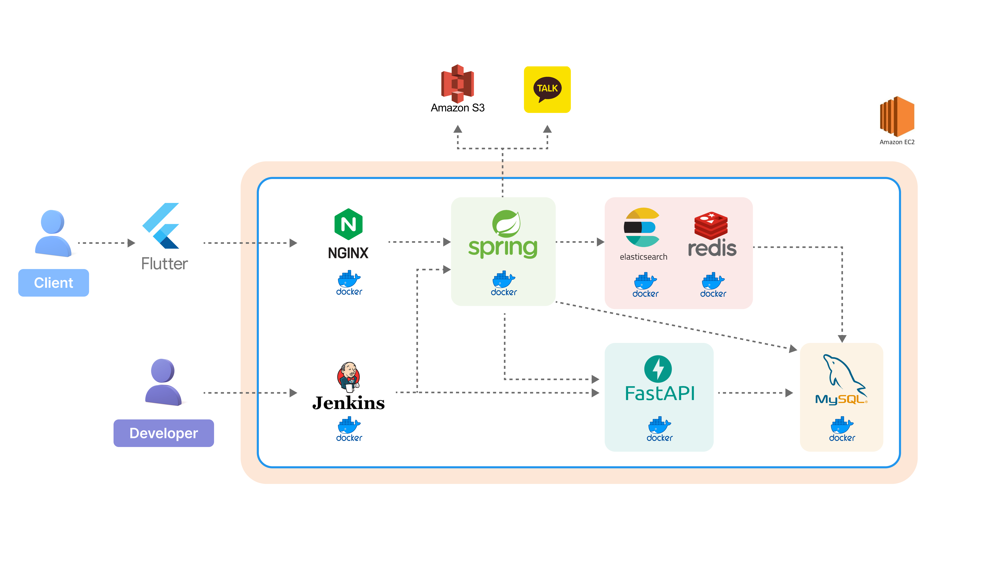

## Flow Chart

## 기술 고도화

- Elasticsearch

  - 검색 엔진 최적화
  - 음절 단위 역 색인을 통한 통합 검색 엔진 지원

  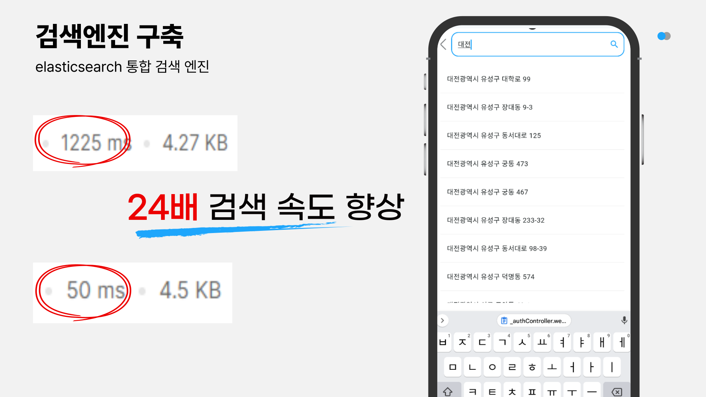

- 캐시 사용

  - real-time에 대해서 반복적인 update 발생
    - redis(cache)의 key-value를 이용하여 real-time(참여자 수) update를 하고 24시간마다 데이터베이스(mysql) 반영
  - 가변성이 적은 data 조회
    - 자주 변화하지 않는 data에 대해서 redis(cache)에 저장 후 조회 시 성능 향상

  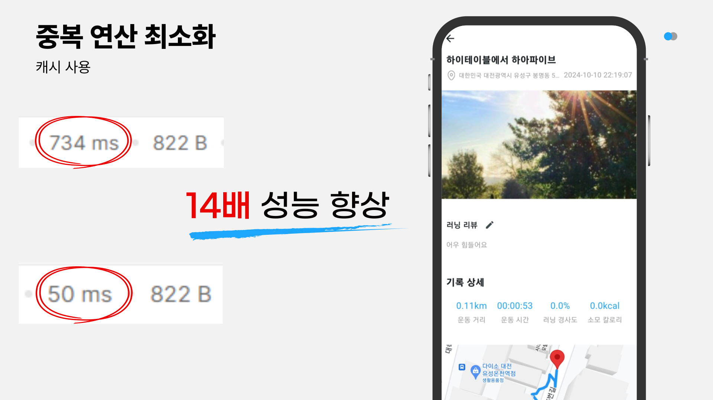

- 추천 알고리즘

  - data 부족 시 CBF, 충분한 data가 쌓여 있을 시 CF알고리즘 이용하여 하이브리드 필터 적용 추천
  - Python LightFm 라이브러리 사용

  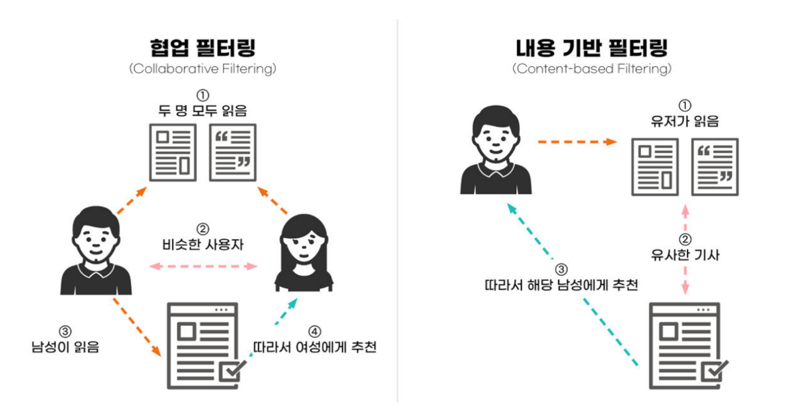

- 경사도 계산 알고리즘
  - 국토지리정보원에서 제공하는 DEM(국도 이미지) 이용하여 고도를 불러오고 고도를 이용하여 경사도 계산
  - FastApi 사용
    
- GPS기반 주변 러닝 코스 목록 조회

  - 지도를 육각형으로 나누어, 미리 구역별로 코스 색인 수행
    - 중복 연산 방지
  - 추천 갱신 시, 사용자 요청에 따라서만 갱신 (갱신 버튼)
  - 조회 시 H3 라이브러리를 통한 색인에 따라 구역별 조회

  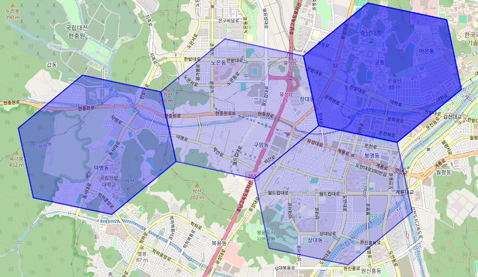

## 구현 화면

| 로그인 페이지                              | 회원가입 페이지                                      | 선호태그                                              |
| ------------------------------------------ | ---------------------------------------------------- | ----------------------------------------------------- |
| 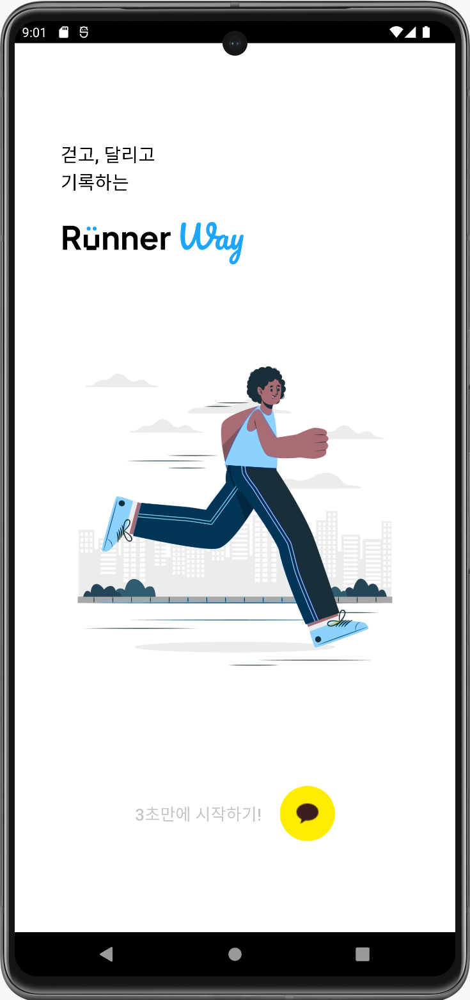       | 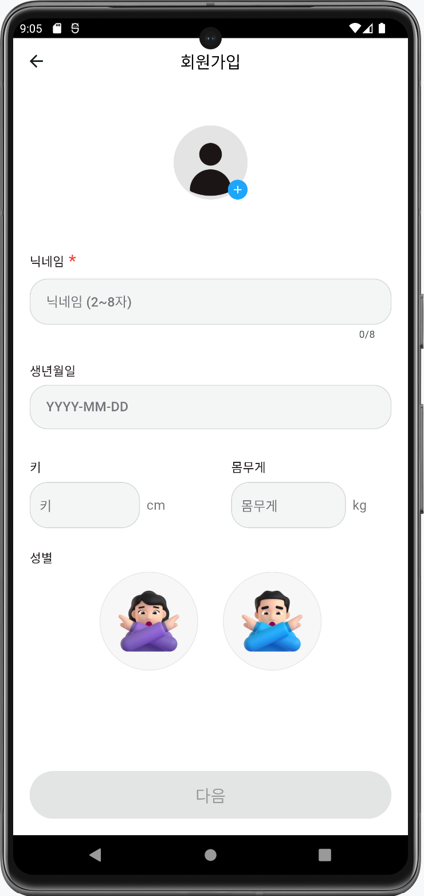          | 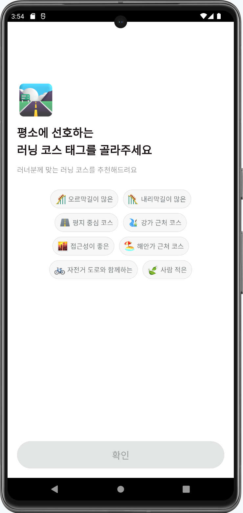               |
| 메인 페이지                                | 러너 코스 리스트 페이지(캐시 전)                     | 러너 코스 리스트 페이지(캐시 후)                      |
|       | 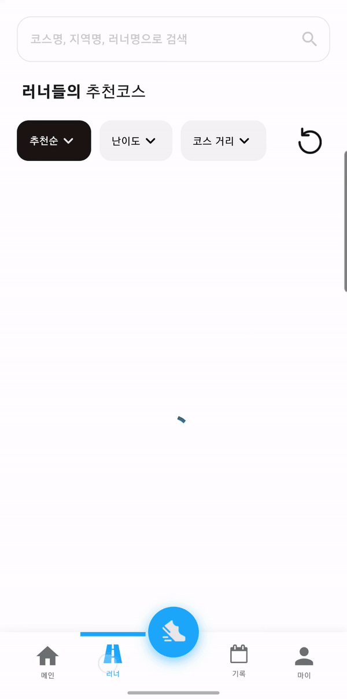   | 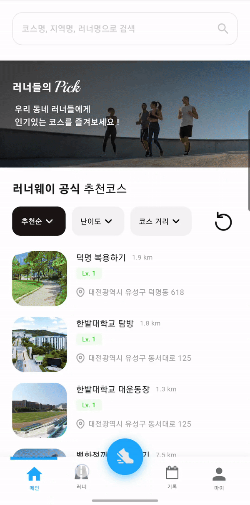   |
| 검색                                       | 추천 페이지                                          | 러닝 상세 페이지                                      |
| 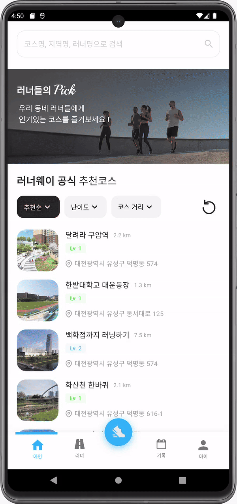           | 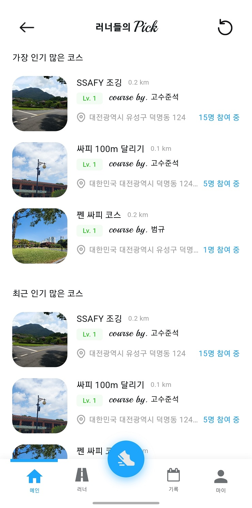                | 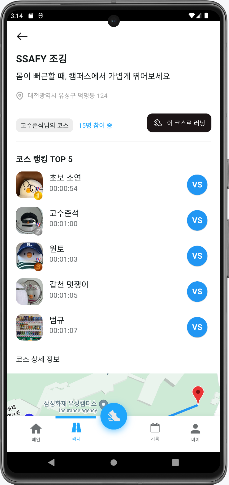               |
| 자유 코스                                  | 유저 코스                                            | 코스 코스                                             |
| 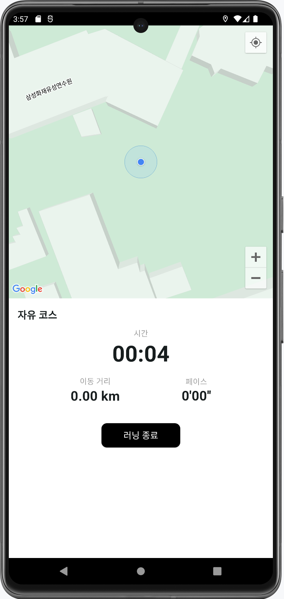      | 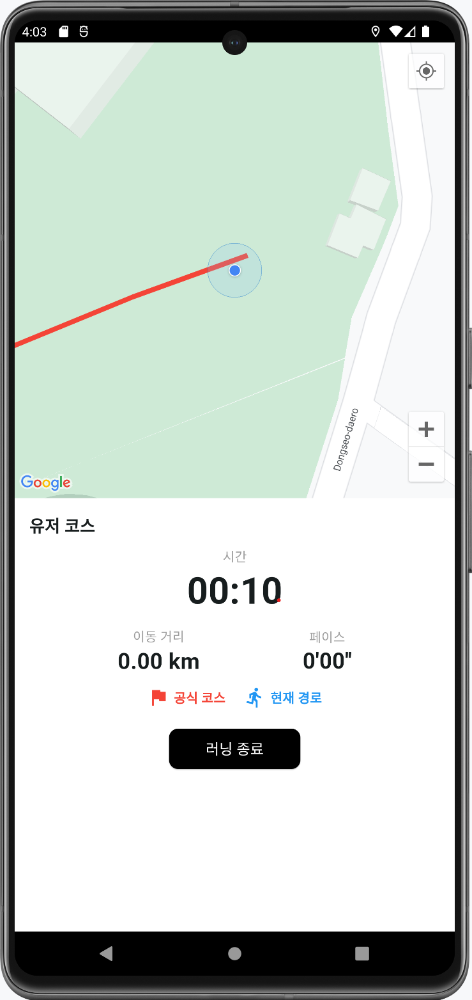                | 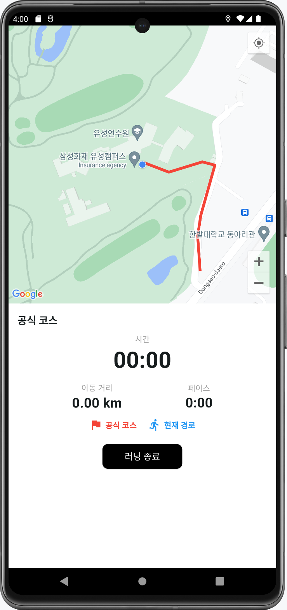             |
| 러닝 시작                                  | 러닝 등록                                            | 러닝 기록                                             |
| 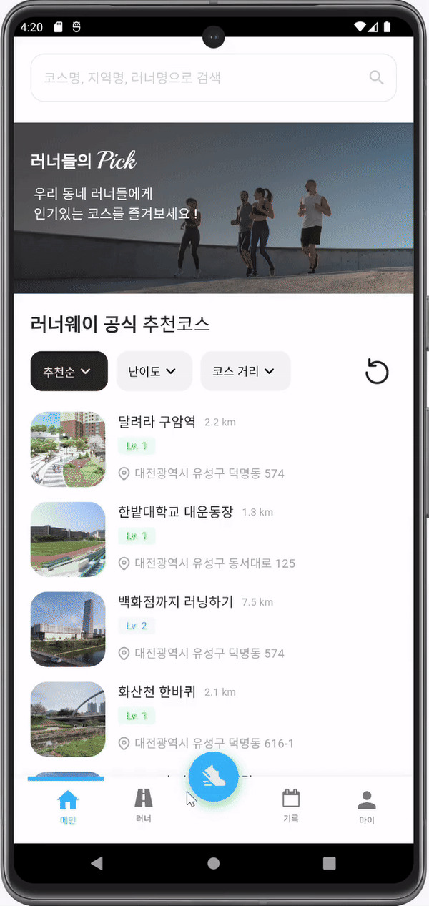    |       |  |
| 러닝 달력                                  | 유저 코스 페이지                                     | 유저 코스 등록                                        |
| 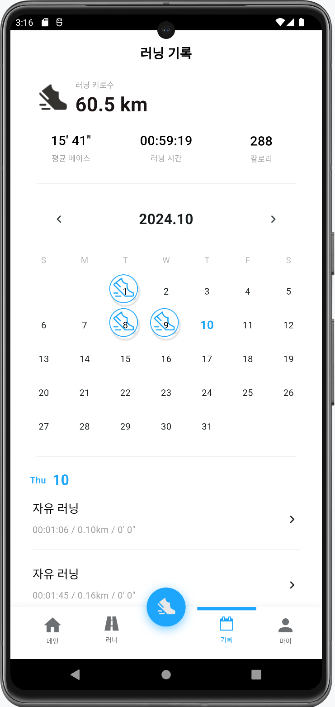 | 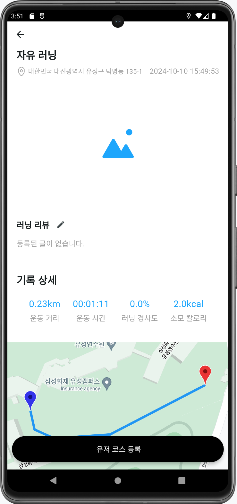 |   |
